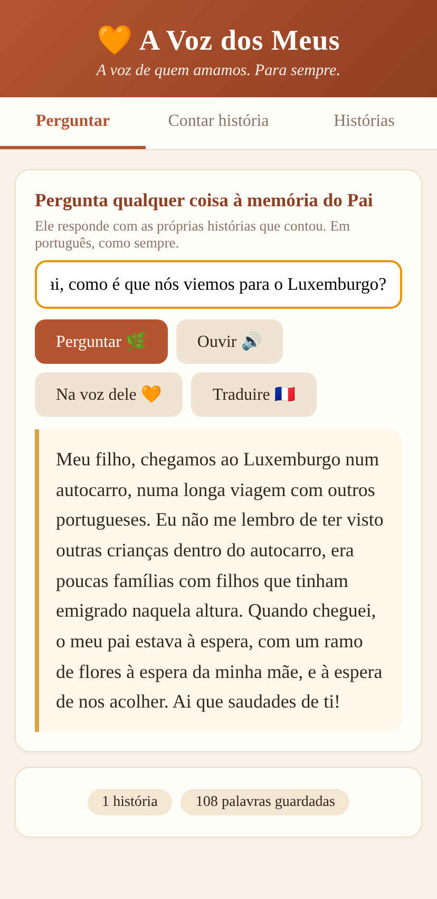
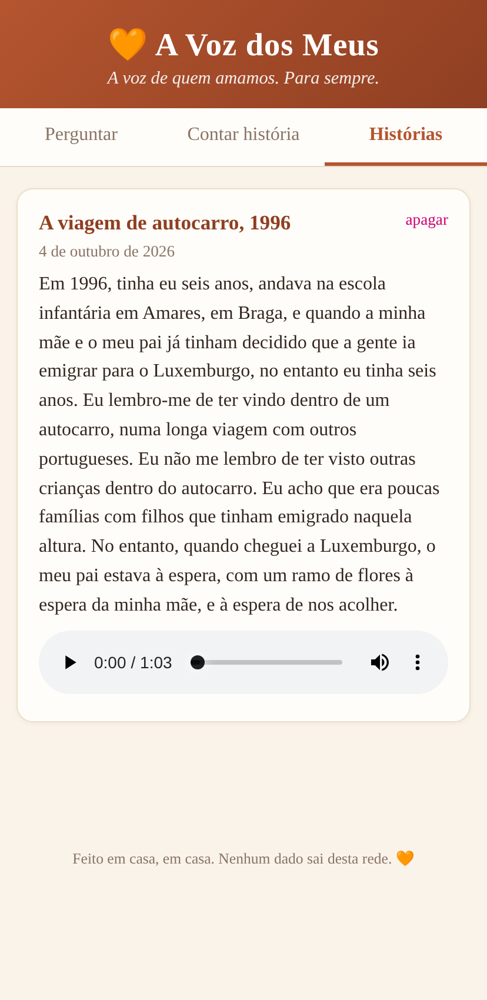
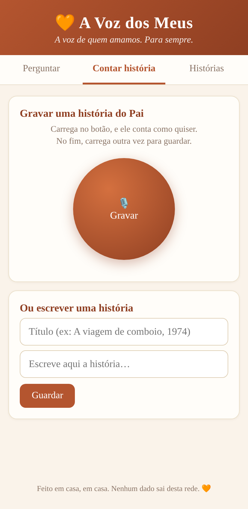

# A Voz dos Meus 🧡
*The Voice of the Ones We Love — A voz de quem amamos. Para sempre.*

We film our children growing up. Nobody films our parents growing old.

Record a loved one's stories, in their own voice, and let the family ask their memory
questions — forever. Built first for **my father**, a Portuguese emigrant in Luxembourg.
Father, grandmother, aunt, friend — the concept is the same: **the people we love most
are the ones we record least.**

**100% local and open-source.** Their voices never leave the house. No cloud, no
subscription, no account, €0.



**Live demo** (a temporary tunnel to the box in my home — the same one my father uses):
https://tariff-ventures-income-insights.trycloudflare.com/




---

## Why this exists

My father left Portugal for Luxembourg decades ago. His stories — how he came, the work,
the Sundays, the friends who became family — live only in his head and in his voice.
One day I realised my children might never hear them from his lips.

So I built this:

1. **He tells a story** — one big red button, he just talks (Portuguese, naturally).
2. **The app writes it down** — open-source Whisper transcribes every word, on our own machine.
3. **The family asks his memory questions** — *"Pai, como era a tua aldeia?"* — and an
   open-weight model (Gemma 3, running locally) answers **only** from his own stories,
   in warm European Portuguese, read aloud in his language.

If he never told that story, the app says so — and tells you to ask him on the next visit.
It will never invent his memories.

## Why open-source matters here

- **Privacy is the product.** These are a family's most intimate recordings. With a closed
  API they would live on someone else's server. Here they never leave the house.
- **It works with no internet** in his kitchen — recording, transcription, questions, voice.
- **It costs €0 forever.** No subscription between him and his grandchildren.
- **Every piece can be swapped** — Whisper, the embeddings, the model — because they're all open.

## Stack (everything open-source)

| Piece | Tech | Runs |
|---|---|---|
| Speech-to-text | [faster-whisper](https://github.com/SYSTRAN/faster-whisper) (Whisper `large-v3-turbo`, int8) | local CPU |
| Reasoning | [Gemma 3 (4B)](https://ollama.com/library/gemma3) via [Ollama](https://ollama.com) | local |
| Honesty gate | Strict SIM/NÃO classifier (Gemma 3) — no answer is generated unless the stories contain it | local |
| Voice cloning | [XTTS v2](https://github.com/idiap/coqui-ai-TTS) — answers read *in his own voice* (CPML, non-commercial) | local CPU |
| Memory (RAG) | [nomic-embed-text](https://ollama.com/library/nomic-embed-text) embeddings + SQLite | local |
| Voice out | Browser SpeechSynthesis (`pt-PT`) | local, offline |
| Backend | Python + Flask (stdlib HTTP to Ollama) | any old laptop / home server |
| Frontend | Single-page HTML, installable PWA, big-button UI for non-tech elders | any phone |

No Docker required, no GPU required, no API keys. An old laptop on the home Wi-Fi is enough.

## Quickstart

```bash
# 1. Install Ollama and pull the two open models
ollama pull gemma3:4b
ollama pull nomic-embed-text

# 2. Install Python deps
pip install flask faster-whisper

# 3. Run
python3 server.py
# → open http://localhost:5577 on any phone/computer on the same network
```

Then: **Contar história** → press the red button → they talk → press again → saved & transcribed.
**Perguntar** → the family asks → answers grounded in their stories, with **Ouvir 🔊** to hear it aloud.

## How "ask their memory" works

```
audio ──▶ faster-whisper ──▶ story text ──▶ chunks ──▶ nomic embeddings ──▶ SQLite
                                                                      │
question ──▶ embed ──▶ retrieve ──▶ strict SIM/NÃO classifier ──▶ Gemma 3 with
"never invent" rules ──▶ warm answer in their language ──▶ SpeechSynthesis aloud
                                              ── or cloned in THEIR voice (XTTS v2)
```

**Honesty by construction.** Before any prose is generated, a strict classifier decides
whether the stories actually contain the answer. If they don't, the generative model is
never called — a model cannot hallucinate what it never sees. The answering prompt also
forbids adding people, places or details that are not in the stories. If the answer isn't
there, the app says they haven't told that one yet — and to ask them next Sunday.

## Roadmap

- [ ] Multiple voices: one archive per person (Pai, Avó, Tia…) in the same app
- [ ] Swap in a European-Portuguese voice model (today's XTTS speaks with a slight Brazilian accent — open pieces get swapped, that's the point)
- [ ] WhatsApp voice-message import (the family's real audio archive)
- [ ] Export the whole memory as a printed family book (PDF)
- [ ] Grandchildren mode: questions in French/Luxembourgish, answers in the original voice + translation
- [ ] One-command installer for non-technical families

## License

MIT — take it, build it for someone you love.
